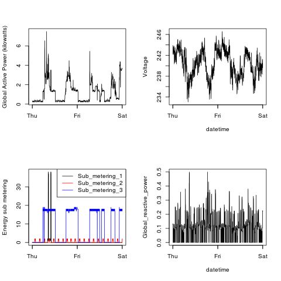

## Files 
The R files used for the assignement:
* plot1.R
* plot2.R
* plot3.R
* plot4.R
* load_data.R
** Load unzipped text file, filter on the 2 days of the project, and add DateTime column
* build_plots.R
** Create functions for each plot of the program; these functions are called by each plot<n>.R files

### Here are the plots, included in the repo

#### Plot 1
 

#### Plot 2

 

#### Plot 3

 

#### Plot 4

 
